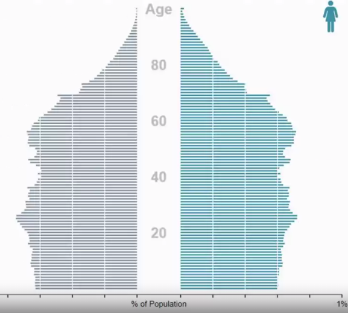
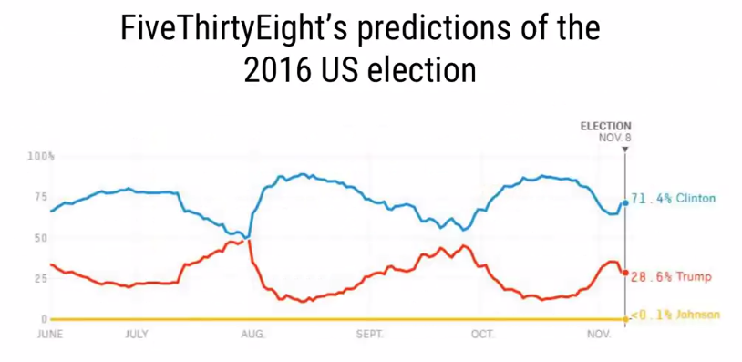
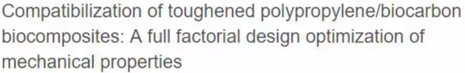

# Data Science in R by JHU 

## Data Science Toolbox

### Types of Data Analysis

__1. Descriptive__

    - early analysis
    - generate simple summaries about sample, i.e. mean
    - NOT for generalizing results to a larger population or trying to make conclusion
    - Example: census

    
__2. Exploratory__

    - examine data and find relationships that weren't previously known
    - explore how variables may be related
    - useful for discovering new connections
    - helps in formulating hypothesis and drive design of future studies and data collections
    - Note: Correlation does not imply causation 

**3. Inferential** 

    - Use a relatively small sample of data to say something about population at large
    - provide estimate of the variable for the population and uncertainty about our estimate
    - accuracy depends on sampling scheme

    
**4. Predictive**

    - use current and historical data to predict outcome
    - accuracy depends on measuring the right variables and using the better models
        - more data and a simple models generally performs better
        - Note: Correlation does not imply causation 

**5. Causal**

    - see what happens to one variable when we manipulate another variable
    - the gold standard in data analysis
    - often applied to results of randomized studies
    - usually analyzed in aggregate and observed relationships are usually average effects, and may not hold through for individuals

**6. Mechanistic**

    - Understand exact changes in variables that lead to exact changes in other variables
    - not as commonly used
    - applied to simple situations that are nicely modelled by deterministic equations
    - commonly applied to physical and engineering sciences
    - often, the only noise is measurement error

________________________________________________________________________________________________________________________________________________

## R Programming
### Data Types
#### R Objects and Attributes
